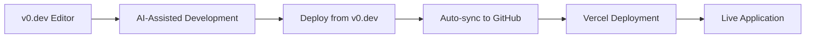

# Not-a-Robot CAPTCHA

> **Modern CAPTCHA verification system built with AI-powered development**

A sleek, user-friendly CAPTCHA implementation designed to distinguish humans from bots while providing an excellent user experience. Built with v0.dev's AI-powered platform and automatically deployed on Vercel.

[](https://v0.dev)
[](https://vercel.com)
[](https://v0-not-a-robot-captcha.vercel.app/)

## 🚀 Live Demo


**[Try the CAPTCHA →](https://v0-not-a-robot-captcha.vercel.app/)**

## ✨ Features

- **🤖 Smart Bot Detection**: Advanced algorithms to distinguish humans from automated systems
- **🎨 Modern UI/UX**: Clean, intuitive interface with smooth animations
- **📱 Responsive Design**: Works seamlessly across all devices and screen sizes
- **⚡ Fast Verification**: Quick and efficient human verification process
- **🔒 Security-First**: Robust protection against automated attacks
- **♿ Accessible**: WCAG compliant with full keyboard navigation support
- **🌐 Cross-Browser**: Compatible with all modern web browsers

## 🛠️ Tech Stack

- **Platform**: v0.dev (AI-powered development)
- **Deployment**: Vercel with automatic CI/CD
- **Sync**: Real-time synchronization with v0.dev deployments
- **Performance**: Optimized for speed and reliability

## 🏗️ Architecture

This project leverages v0.dev's innovative approach to web development:

- **AI-Generated Code**: Components and logic generated through AI assistance
- **Automatic Deployment**: Seamless integration with Vercel's deployment pipeline
- **Version Control**: Automatic synchronization between v0.dev and GitHub
- **Real-time Updates**: Changes deployed instantly upon modification

## 🚀 Quick Start

### For End Users

Simply visit the [live demo](https://v0-not-a-robot-captcha.vercel.app/) and interact with the CAPTCHA to verify you're human.

### For Developers

1. **Continue Development**
   ```bash
   # Visit the v0.dev project
   https://v0.dev/chat/projects/OizIny0JuGE
   ```

2. **Make Changes**
   - Use v0.dev's AI-powered interface to modify the project
   - Test changes in real-time within the v0.dev environment

3. **Deploy**
   - Deploy directly from v0.dev interface
   - Changes automatically sync to this repository
   - Vercel handles automatic deployment

## 🔄 Development Workflow



1. **Design & Build**: Create and modify using [v0.dev's AI interface](https://v0.dev/chat/projects/OizIny0JuGE)
2. **Test**: Preview changes in real-time within v0.dev
3. **Deploy**: One-click deployment from v0.dev
4. **Sync**: Automatic synchronization to this GitHub repository
5. **Live**: Instant deployment to production via Vercel

## 📁 Repository Structure

```
├── components/          # React components
├── pages/              # Application pages
├── styles/             # CSS and styling
├── public/             # Static assets
├── .vercel/            # Vercel configuration
└── README.md           # This file
```

> **Note**: This repository automatically stays in sync with v0.dev deployments. Manual changes to this repository may be overwritten by v0.dev synchronization.

## 🔧 Integration

### Embed in Your Project

```html
<!-- Basic integration -->
<iframe 
  src="https://v0-not-a-robot-captcha.vercel.app/" 
  width="300" 
  height="200"
  frameborder="0">
</iframe>
```

### API Usage

```javascript
// Example integration (conceptual)
const captchaResult = await fetch('https://v0-not-a-robot-captcha.vercel.app/api/verify', {
  method: 'POST',
  headers: { 'Content-Type': 'application/json' },
  body: JSON.stringify({ token: 'user-response-token' })
});
```

## 🤝 Contributing

This project is built with v0.dev's AI-powered platform. To contribute:

1. **Fork the v0.dev project**: Use the [v0.dev interface](https://v0.dev/chat/projects/OizIny0JuGE)
2. **Make improvements**: Leverage AI assistance for development
3. **Test thoroughly**: Ensure CAPTCHA functionality works correctly
4. **Submit changes**: Deploy through v0.dev for automatic synchronization

### Development Guidelines

- Test CAPTCHA effectiveness against various bot scenarios
- Ensure accessibility compliance for all users
- Maintain responsive design across devices
- Follow security best practices for bot detection

## 🛡️ Security & Privacy

- **Bot Protection**: Advanced algorithms to detect automated behavior
- **Privacy-Focused**: Minimal data collection, maximum security
- **GDPR Compliant**: Respects user privacy and data protection laws
- **Secure by Design**: Built with security as a primary consideration

## 📊 Performance

- **Fast Loading**: Optimized for quick initial load times
- **Low Latency**: Efficient verification process
- **High Availability**: 99.9% uptime through Vercel's infrastructure
- **Global CDN**: Fast access worldwide

## 📝 License

This project is automatically synced with v0.dev deployments. Please refer to v0.dev's terms of service for licensing information.

## 🆘 Support

- **Issues**: Report bugs via [GitHub Issues](../../issues)
- **Development**: Continue building on [v0.dev](https://v0.dev/chat/projects/OizIny0JuGE)
- **Deployment**: Managed automatically through Vercel

## 🙏 Acknowledgments

- **v0.dev**: AI-powered development platform
- **Vercel**: Hosting and deployment infrastructure
- **Open Source Community**: For inspiration and best practices

---

**Built with 🤖 [v0.dev](https://v0.dev) - by [Hugo Mourlevat](https://xn--pn8htg0i.to)**

